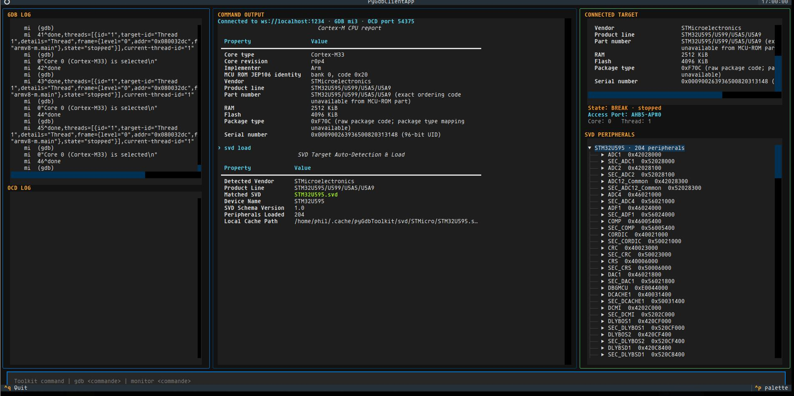

# Installation and first session

## Requirements

- Python 3.12 or newer.
- GDB with embedded Python support, typically `gdb-multiarch` for Arm targets.
- A supported debug probe and pyOCD or OpenOCD configured for your board.
- A connected, powered target. Cortex-M-specific commands require a Cortex-M core.

Install pyGdbToolkit from a checkout:

```console
python3 -m venv .venv
. .venv/bin/activate
python -m pip install .
```

GDB's embedded Python must be compatible with the Python environment containing
the package. Check its version and import path before connecting:

```console
gdb-multiarch -nx -batch -ex 'python import sys; print(sys.version); print(sys.path)'
```

If GDB cannot import the package, install it using a compatible Python interpreter
or add that environment's `site-packages` directory to GDB's `sys.path`.

## Choose a session mode

Use **the server and client** to supervise the probe server and GDB together,
inspect live logs, and browse peripherals in a terminal dashboard. Use **direct
GDB** when you already have a working GDB session or want its native interface.
The toolkit commands are the same in both modes.

## Server and client

Choose an [example configuration](configuration-examples.md), save it as
`servercfg.json`, and adapt the probe, target and executable paths. Run:

```console
pyGdbServer servercfg.json
```

In another terminal, activate the installed environment and connect to the
WebSocket address selected in the configuration:

```console
pyGdbClient ws://localhost:1234
```

Use the configured port: the OpenOCD example uses `1235`, whereas the pyOCD
example uses `1234`. The server starts the OCD, connects GDB, imports the toolkit
and runs the configured initialization commands before accepting clients.

Enter `lscpu` in the client prompt to inspect the processor. Use `gdb info
registers` for a native GDB command and `monitor help` for OCD commands. Enter
`quit` to close only the client; `quit --all` also stops the supervised session.



See [server and client reference](pygdbserver.md) for configuration, logs,
remote-access precautions and automation.

## Direct GDB

Start your board's pyOCD or OpenOCD GDB server separately. Start GDB with your
firmware ELF file, then connect and load the toolkit:

```console
gdb-multiarch firmware.elf
```

```gdb
target extended-remote localhost:3333
monitor reset halt
python import pyGdbToolkit
lscpu
```

Replace `3333` with the port used by your OCD. The reset command is OCD-dependent
and resets the target; omit it if the current target state must be preserved.

## Inspect a peripheral

Halt the target before an inspection that requires a consistent snapshot. Load
the matching SVD description automatically or supply a local file:

```gdb
svd load
```

```gdb
svd read /path/to/device.svd
svd list
```

Use `svd show` with a peripheral name listed by your device's SVD. Automatic
loading may need network access; loading a local SVD works offline. The client
also exposes loaded peripherals in its interactive tree.

Register reads can have hardware side effects, and `svd write` changes target
state. Consult the device reference manual before accessing sensitive registers.
See the [SVD command reference](svd.md) for syntax and limitations.

## Common startup problems

| Symptom | Check |
| --- | --- |
| GDB cannot import `pyGdbToolkit` | Embedded Python version and `sys.path`; activate the correct environment before starting the server. |
| OCD fails to start | Executable path, board scripts, probe identifier, USB permissions and other processes using the probe. |
| Client cannot connect | Server startup completed, configured WebSocket host and port, and firewall rules. |
| SVD loading fails | Network access, supported target identity, or use `svd read` with a local file. |
| A command cannot read target memory | Target connection, selected core, halt state and debug-access restrictions. |

Keep the API on loopback for local sessions. Remote access requires a trusted
network and appropriate TLS/authentication protection; the server configuration
alone does not provide those protections.
