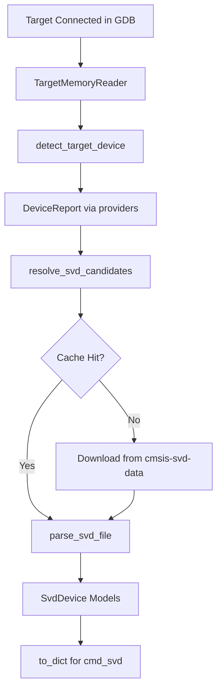

# CMSIS-SVD Provider Technical Documentation

The `svd` module ([src/pyGdbToolkit/svd.py](src/pyGdbToolkit/svd.py)) provides download, caching, parsing, and dictionary mapping primitives for CMSIS-SVD (System View Description) hardware descriptions.

It is designed as an underlying provider layer intended for use by GDB inspection commands such as `cmd_svd.py`.

---

## Technical Overview

The module performs:
1. **Target Detection**: Uses `TargetMemoryReader` and the provider registry from `cmd_lscpu` to extract CPU and SoC information (`DeviceReport`).
2. **Vendor & SoC Candidate Generation**: Normalizes vendor names and generates case-insensitive candidate filenames (handling `xx`, `x`, lower/upper case variants, and part-number truncations).
3. **Repository Resolution & Caching**: Downloads SVD files from [cmsis-svd/cmsis-svd-data](https://github.com/cmsis-svd/cmsis-svd-data) and stores them locally in `$XDG_CACHE_HOME/pyGdbToolkit/svd` (or `~/.cache/pyGdbToolkit/svd`).
4. **SVD Parsing**: Parses the XML definitions into immutable models (`SvdDevice`, `SvdPeripheral`, `SvdRegister`, `SvdField`) with complete support for peripheral inheritance (`derivedFrom`).
5. **Dictionary Export & Value Decoding**: Generates plain nested Python dictionaries and bit-field decoding helpers.

---

## Architecture and Workflow

---

## Data Models

The module defines typed immutable models using `dataclasses`:

### `SvdField`
- **`name`**: Bit-field name (e.g. `EN`, `TXE`, `RXNE`).
- **`description`**: Human-readable field description.
- **`bit_offset`**: Position of the least significant bit in the register.
- **`bit_width`**: Width of the bit-field in bits.
- **`bit_mask`**: Computed integer mask.
- **`access`**: Read/write access rights (`read-only`, `write-only`, `read-write`, etc.).
- **`reset_value`**: Optional reset value.
- **`extract_value(reg_value)`**: Helper method returning the shifted integer value from a raw register word.
- **`to_dict()`**: Exports to a standard Python dictionary.

### `SvdRegister`
- **`name`**: Register identifier (e.g. `CR1`, `SR`, `DR`).
- **`display_name`**: Optional register display name.
- **`description`**: Register functional documentation.
- **`address_offset`**: Byte offset from peripheral base address.
- **`size`**: Register width in bits (default: 32).
- **`access`**: Default access permissions.
- **`reset_value`**: Value at reset.
- **`reset_mask`**: Mask of valid reset bits.
- **`fields`**: Tuple of `SvdField` objects.
- **`get_field(name)`**: Case-insensitive lookup of a field.
- **`decode(value)`**: Decodes a raw numeric register value into detailed dictionaries of bit-field values and descriptions.
- **`to_dict()`**: Exports register and its fields to a dictionary.

### `SvdPeripheral`
- **`name`**: Peripheral name (e.g. `USART1`, `GPIOA`, `RCC`, `I2C1`).
- **`description`**: Peripheral functional documentation.
- **`group_name`**: Optional logical group name.
- **`base_address`**: Physical base address in target memory.
- **`derived_from`**: Optional parent peripheral identifier for inherited registers.
- **`registers`**: Tuple of `SvdRegister` objects.
- **`get_register(name_or_offset)`**: Lookup by register name (case-insensitive) or address offset (integer).
- **`to_dict()`**: Exports peripheral and registers to a dictionary.

### `SvdDevice`
- **`name`**: Device / MCU name (e.g. `STM32F401`, `nRF52840`).
- **`version`**: SVD schema / file version.
- **`description`**: Overview of the device.
- **`vendor`**: Silicon vendor name.
- **`peripherals`**: Tuple of `SvdPeripheral` objects.
- **`get_peripheral(name_or_address)`**: Case-insensitive lookup by name or base address.
- **`find_peripheral_by_address(address)`**: Locates the peripheral, matching register, and offset containing a given memory address.
- **`to_dict()`**: Exports the entire device hierarchy into a nested dictionary.

---

## Candidate SVD Matching Engine

When identifying SVD files from a `DeviceReport` generated by `lscpu`:
1. **Vendor Normalization**:
   Maps vendor names (e.g. `STMicroelectronics`, `Nordic Semiconductor`, `Raspberry Pi`, `NXP Semiconductors`) to canonical folder names in `cmsis-svd-data` (`STMicro`, `Nordic`, `RaspberryPi`, `NXP`, etc.).
2. **Multi-Vendor Candidate Generation**:
   From product line and part number strings:
   - Cleans annotations and packaging notes (e.g. `(exact ordering code unavailable...)`).
   - Generates exact matches (`STM32F401.svd`, `stm32f401.svd`, `STM32F401xx.svd`, `STM32F401x.svd`).
   - Generates family-level truncations (`STM32F4.svd`, `nrf52.svd`, `LPC11xx.svd`).

---

## Public API Reference

### Target Detection & Automated Loading
- **`get_svd_for_target(reader=None, cpuid=None, cache_dir=None, force_download=False) -> SvdDevice`**
  Inspects the active target in GDB, resolves the candidate SVD file, fetches/caches it, and returns the parsed `SvdDevice`.
- **`load_svd_dict_for_target(reader=None, cpuid=None, cache_dir=None, force_download=False) -> dict[str, Any]`**
  Convenience function returning the target SVD directly as a nested dictionary.

### Explicit Resolution (Manual Override)
- **`get_svd_by_name(vendor: str, svd_name: str, cache_dir=None, force_download=False, timeout=15.0) -> SvdDevice`**
  Fetches an SVD explicitly by vendor directory and filename, bypassing target auto-detection.
- **`load_svd_dict_by_name(vendor: str, svd_name: str, cache_dir=None, force_download=False, timeout=15.0) -> dict[str, Any]`**
  Loads an explicit SVD by vendor and name directly as a dictionary.

### Local File Parsing
- **`parse_svd_file(file_path: Path | str) -> SvdDevice`**
  Parses a local `.svd` file directly from the filesystem.
- **`load_svd_dict(file_path: Path | str) -> dict[str, Any]`**
  Parses a local `.svd` file and returns its dictionary representation.
