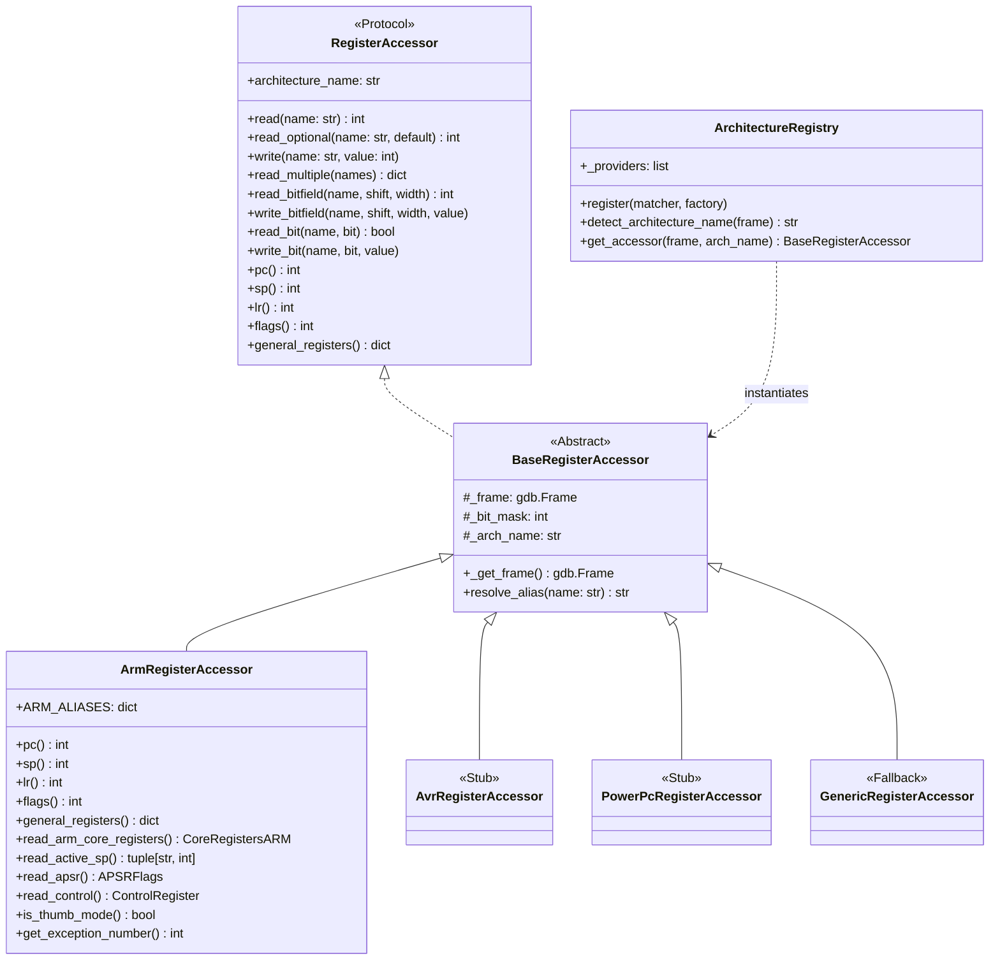

# Architecture de manipulation des registres GDB

Le module `pyGdbToolkit.registers` fournit une interface unifiée et extensible pour la manipulation des registres CPU via l'API Python de GDB, ciblant diverses familles de microcontrôleurs (ARM Cortex-M, AVR, PowerPC MPC, etc.).

## Diagramme de classes



## Structure des modules

- `pyGdbToolkit.registers` : Protocoles (`RegisterAccessor`), exceptions, classe de base abstraite (`BaseRegisterAccessor`), registre de sélection d'architecture (`ArchitectureRegistry`), accesseur générique de repli (`GenericRegisterAccessor`) et fonctions utilitaires de commodité.
- `pyGdbToolkit.arch.registers_arm` : Implémentation spécialisée pour l'architecture ARM (`ArmRegisterAccessor`), décodage Cortex-M (APSR, CONTROL, MSP/PSP, exception number).
- `pyGdbToolkit.arch.registers_avr` : Stub pour microcontrôleurs 8-bit AVR (`AvrRegisterAccessor`).
- `pyGdbToolkit.arch.registers_ppc` : Stub pour microcontrôleurs PowerPC / MPC (`PowerPcRegisterAccessor`).
- `pyGdbToolkit.arch` : Sous-paquet regroupant l'ensemble des modules d'architectures concrètes.

> **Note importante :** Le module `registers` est un **module interne d'infrastructure** conçu pour simplifier l'écriture et le découplage des commandes Python du toolkit (comme `lscpu`, `faultinfo`, etc.). Il **n'est pas exporté sous forme de commande CLI GDB** (aucune sous-classe de `gdb.Command` n'est enregistrée pour ce module).

---

## Exemples d'utilisation interne

### 1. Accès unifié et automatique selon la cible active

```python
from pyGdbToolkit.registers import (
    ArmRegisterAccessor,
    get_register_accessor,
    read_bit,
    read_bitfield,
    read_register,
    try_read_register,
)

# Sélection automatique selon l'architecture de la cible connectée dans GDB
regs = get_register_accessor()

# Accès génériques universels
pc = regs.pc()
sp = regs.sp()
flags = regs.flags()
core_regs = regs.general_registers()

# Manipulation de champs de bits et drapeaux
is_thumb = read_bit("xpsr", bit=24)
exception_num = read_bitfield("xpsr", shift=0, width=9)

# Fonctionnalités spécialisées ARM lorsqu'on cible un microcontrôleur Cortex-M
if isinstance(regs, ArmRegisterAccessor):
    sp_type, sp_val = regs.read_active_sp()   # 'msp' ou 'psp' selon mode/CONTROL.SPSEL
    exc_num = regs.get_exception_number()     # 0 si Thread mode, > 0 si Handler mode
    apsr = regs.read_apsr()                   # drapeaux N, Z, C, V, Q, GE
    control = regs.read_control()             # nPRIV, SPSEL, FPCA
    if control and control.npriv:
        print("Exécution en mode non-privilégié (Unprivileged)")
```

### 2. Fonctions globales de commodité

```python
from pyGdbToolkit.registers import read_register, try_read_register, write_register

# Lecture directe
pc = read_register("pc")

# Lecture sécurisée avec valeur de repli si le registre est inaccessible
lr = try_read_register("lr", default=0)

# Écriture dans un registre
write_register("r0", 0x12345678)
```
