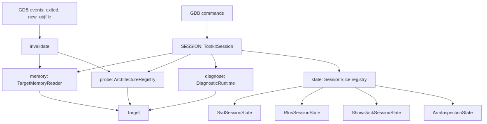

<!--
SPDX-FileType: DOCUMENTATION
SPDX-FileCopyrightText: 2026 H2Lab Development Team
SPDX-License-Identifier: Apache-2.0
-->
# Unified Session Technical Documentation

The session module ([implementation](https://github.com/h2lab/pyGdbToolkit/blob/main/src/pyGdbToolkit/session.py)) owns the whole
runtime context of a GDB debugging session: target-memory access, architecture identity,
diagnostic dispatch, and the per-command state previously scattered across the command modules.

Commands no longer create nor own their context. They request it from the process-wide `SESSION`
object, which handles its storage, its maintenance, and its invalidation.

---

## Technical Overview

The module provides:
1. **A single target-memory accessor**: one `TargetMemoryReader` is built per session and reused by
   every command instead of one reader per command invocation.
2. **A cached, architecture-neutral target identity**: the `ArchitectureRegistry` probes the target
   once, and the result is shared by all consumers.
3. **A diagnostic entry point**: `SESSION.diagnose()` dispatches a service through the
   `DiagnosticRuntime` without the caller handling the reader plumbing.
4. **A typed state registry**: each command declares a `SessionSlice` subclass and retrieves its
   unique instance through `SESSION.state()`.
5. **Coherence maintenance**: GDB events that change the target invalidate the volatile caches
   without destroying user-visible command state.
6. **Confirmed discovery metadata**: `memmap discover` supplements architectural identity with
  a hardware-backed vendor/SoC-family fingerprint, source-declared regions, candidates and samples.

---

## Architecture and Workflow



---

## Data Models

### `SessionSlice`

Abstract base class of every command-owned state fragment.

- **`reset()`**: Abstract. Clears the slice **in place** and releases its target-dependent
  resources (breakpoints, watchpoints, decoded models).

A slice is created once per session and is never replaced, so a command module may bind it at
import time and keep a direct reference to it for the whole session. This is why clearing a slice
always happens in place rather than by rebinding a new instance.

### `ToolkitSession`

Owner of the session context.

- **`memory`**: Property returning the shared `WritableTargetMemory` accessor, built on first use
  from GDB's selected inferior. Raises `TargetReadError` when no inferior can be selected, which
  preserves the historical per-command error messages.
- **`probe()`**: Returns the cached `ProbeResult` produced by the architecture registry.
- **`architecture`**: Property returning the detected `Architecture`, or `None` when no registered
  probe recognized the target.
- **`trace_capabilities()`**: Returns cached, read-only `TraceCapabilities` for the current target.
- **`has_etm()`**, **`has_etb()`**, **`has_mtb()`**, **`has_etf()`**: Return whether the corresponding
  trace component was positively identified. These do not enable or configure tracing.
- **`require_target()`**: Returns the detected `TargetDescription` or raises `gdb.GdbError` with
  the probe's unavailability reason.
- **`require_target_of(description_type)`**: Same contract, narrowed to an architecture-specific
  description class (for example `CortexMTargetDescription`). Raises `gdb.GdbError` when the
  connected target is not described by that class.
- **`diagnose(service, access)`**: Runs one `DiagnosticServiceName` through the diagnostic runtime
  using the shared memory accessor, and returns the resulting `DiagnosticResult`.
- **`state(slice_type)`**: Returns the unique instance of a `SessionSlice` subclass, creating and
  registering it on first request.
- **`publish_discovery(report, context)`**: Publishes a `MemoryMapReport` only if its fingerprint
  is `hardware-confirmed` and its access context matches the current context. Returns a boolean;
  uncertain or conflicting identity clears the previous shared discovery.
- **`discovery`**: Returns the current confirmed `MemoryMapReport` or `None`. Its context callback
  is checked on access, preventing stale data after core, connection, object-file or SVD changes.
- **`target_info`**: Returns the confirmed `TargetFingerprint` or `None`; includes vendor, SoC
  family, architecture, confidence, evidence and a separately labelled server ordering code.
- **`memory_regions`**: Returns a tuple of declared `MemoryRegion` records, or an empty tuple.
  Declaration is not proof of accessibility, and candidate windows are never merged into it.
  `discovery.execution_hints` and `execution_assessments()` retain PC/SP and
  architecture-specific vector/handler associations without inferred capacities.
  Architecture candidates, including the ARMv8-M ROM/Flash window at `0x18000000`,
  stay in `discovery.candidates` and are never injected into `memory_regions`.
- **`invalidate()`**: Drops the cached memory accessor, probe result and shared discovery, leaving command state
  untouched.
- **`reset()`**: Invalidates the caches, then calls `reset()` on every registered slice.

### `SESSION`

The process-wide `ToolkitSession` instance used by all commands.

### `install_event_hooks(session)`

Connects `gdb.events.exited`, `gdb.events.new_objfile`, and `gdb.events.clear_objfiles` to
`session.invalidate()`. The hooks are installed defensively: an embedded interpreter that does not
expose these event registries is silently supported.

---

## Multi-Architecture Support

The session core stays architecture-neutral: it only manipulates `Architecture`,
`TargetDescription`, `ProbeResult`, and `DiagnosticResult`, which are the portable contracts of
the [`arch`](https://github.com/h2lab/pyGdbToolkit/tree/main/src/pyGdbToolkit/arch) package. Adding a new architecture therefore requires no
change in the session module: registering an `ArchitectureProbe` in `DEFAULT_ARCHITECTURE_REGISTRY`
is enough for `SESSION.probe()` to recognize its targets.

### Initial AArch64 support

The `arch.aarch64` package is separate from `arch.arm`. Its probe runs before the Arm
probes and recognizes explicit GDB architecture names such as `aarch64` and
`aarch64:ilp32`, obtained from the memory reader's bound inferior. Recognition does
not read target memory, including the Cortex-M CPUID address.

An AArch64 session exposes `Architecture.AARCH64` and an `AArch64TargetDescription`
containing the GDB architecture name. The CPU model and revision are not inferred:
the initial description uses `AArch64` and `unknown`. Ambiguous names such as
`armv8-a` alone do not establish AArch64 execution state. When needed, select
`set architecture aarch64` in GDB before initializing the session.

The architecture probe itself only loads and identifies the architecture without
system-register access. The `lscpu` command additionally has a dedicated AArch64
register collector and renderer; see [lscpu.md](lscpu.md). Other commands have
not gained AArch64 diagnostic implementations, and Cortex-M services are not
dispatched for AArch64 targets. Independently, the core controller supports
configured multicore systems through supervised J-Link endpoints; see
[SMP support](smp.md). The portable controller does not interpret architecture
affinity values as configured core IDs or provide atomic all-core halt/resume.

Architecture-specific caching lives in the architecture package itself. For Arm, the
[Arm session state](https://github.com/h2lab/pyGdbToolkit/blob/main/src/pyGdbToolkit/arch/arm/session_state.py) module
defines `ArmInspectionState` and mutualizes:

- **`cortex_m_target(session)`**: Decoded CPUID identity (`CortexMTargetDescription`).
- **`rom_table_discovery(session)`**: CoreSight ROM-table discovery (`CoreSightDiscovery`).
- **`device_report(session)`**: Manufacturer `DeviceReport` produced by the provider registry.

This module is deliberately **not** re-exported by `arch.arm.__init__`: it is the only place where
the `arch` package depends on the session, and keeping it out of the package surface guarantees
that `arch` stays usable, and testable, without any session or GDB concern.

## Read-Only Trace Capabilities

```python
from pyGdbToolkit.session import SESSION

capabilities = SESSION.trace_capabilities()
if capabilities.is_available:
    present = (SESSION.has_etm(), SESSION.has_etb(), SESSION.has_mtb())
    for component in capabilities.components:
        print(component.kind, hex(component.base), component.version,
              component.security_filtering, component.buffer_size_bytes)
else:
    print(capabilities.unavailable_reason)
```

The portable models and `TraceCapabilityRegistry` live in `arch.trace`; Arm register
decoding lives in `arch.arm.trace`. A backend is registered per architecture. A new
architecture can supply another probe without modifying `ToolkitSession`. Custom sessions
can inject a registry through `ToolkitSession(trace_registry=...)`.

The current Arm backend supports Cortex-M target descriptions and the existing ordered
MCU/processor ROM-table roots, including nested class-1 tables. It does not guess fixed
ETM/ETB/MTB addresses from the CPU name. `discover_trace_capabilities(reader, discovery)`
also accepts an existing `CoreSightDiscovery`, including a caller-supplied ROM topology.
It returns every recognized component, not only the first trace source or sink. On a
multi-core topology these are reachable components, not a claim of per-core ownership.

- **ETM**: Architected ETMv4 identification uses Arm `DEVARCH` (including `PRESENT` and
  architect identity); its revision supplies the minor architecture version. Known legacy
  Arm PIDR parts fall back to `ETMIDR`; known older ETMv4 parts can use `TRCIDR1`.
  Version is the trace architecture version, not the silicon/PIDR revision.
- **Secure/non-Secure distinction**: `security_filtering` is `True` or `False` when
  the capability registers are readable, otherwise `None`. Legacy ETM uses the security
  extension field in `ETMIDR`. ETMv4 uses the Secure/non-Secure masks advertised by
  `TRCIDR3`, preserved as `secure_exception_levels` and `nonsecure_exception_levels`.
  Both nonempty masks establish support for distinguishing the states. This is not a
  check of authentication, current trace configuration, or Secure debug access permissions.
- **ETB**: The classic Arm ETB reports `RAM_DEPTH * 4` bytes. Recognized Arm TMCs use
  `DEVID.CONFIGTYPE` to distinguish ETB from ETF and external-memory ETR/ETS; embedded
  capacity is `RSZ * 4` bytes. ETF is exposed separately, not counted as ETB.
- **MTB**: Identification uses the Arm MTB `DEVARCH` or known legacy Arm PIDR parts.
  No total buffer capacity is inferred from the currently programmed MTB mask.

No control register is written, no lock is cleared, no power domain is enabled, and
no trace data is read or consumed. Optional register read errors preserve recognized
component presence and are recorded in `component.registers` as `RegisterValue` evidence.
Unknown version, security support, or buffer size is `None`, never a guessed value.

`has_*()` reports confirmed presence only. `False` is not proof of hardware absence:
an unsupported architecture, inaccessible ROM table, or component invisible through the
selected memory access may prevent detection. Inspect `is_available`, `unavailable_reason`,
and register evidence when this distinction matters. Only known/architected identities are
recognized; unknown components are not classified just because they are CPU trace sources.
Class-9 ROM-table traversal and powering inaccessible components are not added by this API.

The trace cache is cleared by both `invalidate()` and `reset()`, including core switches
that invalidate the session. Failed results are cached too; invalidate the session before
retrying after access permissions or connectivity change.

Register encodings were checked against
[Arm CSAL register definitions](https://github.com/ARM-software/CSAL/blob/master/include/csregisters.h),
[Linux ETMv4 definitions](https://github.com/torvalds/linux/blob/master/drivers/hwtracing/coresight/coresight-etm4x.h),
and [pyOCD component identities](https://github.com/pyocd/pyOCD/blob/main/pyocd/coresight/component_ids.py).

---

## Session State Slices

| Slice | Module | Contents | Reset behavior |
|---|---|---|---|
| `SvdSessionState` | `cmd_svd` | Parsed `SvdDevice`, dictionary export, SVD file path, register watchpoints | Deletes the watchpoints, drops the device model |
| `RtosSessionState` | `cmd_rtos` | Selected RTOS module, project path, decoded task list, scheduler trace | Deletes the scheduler trace, drops the project and the selection |
| `ShowstackSessionState` | `cmd_showstack` | Stack selected by the user (`msp` / `psp` / auto) | Restores automatic stack selection |
| `ArmInspectionState` | `arch.arm.session_state` | CPUID identity, ROM-table discovery, device report | Drops every cached inspection result |
| `MemoryMapSessionState` | `cmd_memmap` | Latest command report and SVD identity used for discovery | Drops the snapshot; shared discovery is also cleared by session invalidation |

---

## Cache Invalidation Policy

Two levels of clearing are distinguished, because target-derived data and user-supplied data do not
have the same lifetime:

- **`invalidate()`** drops only what is re-derivable from the target: the memory accessor and the
  probe result, trace capabilities, plus the confirmed discovery metadata. It is what GDB event hooks call, so reconnecting a probe or loading new symbols
  never discards user work such as a loaded SVD file or an RTOS project.
- **`reset()`** additionally clears every registered slice. It is the full session teardown, used
  when the whole context must return to its initial state.

Note that `ArmInspectionState` holds target-derived data but lives in a slice, so it survives
`invalidate()` and is cleared by `reset()`.
The confirmed shared `discovery` does not survive invalidation. The memory-map
command snapshot may still be exported with its original context; it cannot be
silently republished or probed for another core. A fresh `memmap discover` is required.

---

## Usage

### Consuming confirmed discovery metadata

Run `memmap discover` or `memmap discover --verify` in the GDB CLI first. No SVD
or firmware ELF is required when the server and hardware supply enough evidence.

```python
from pyGdbToolkit.session import SESSION

identity = SESSION.target_info
if identity is not None:
  print(identity.vendor, identity.soc, identity.confidence)
  for region in SESSION.memory_regions:
    print(hex(region.start), hex(region.end), region.kind, region.source)

report = SESSION.discovery
if report is not None:
  print(report.candidate_assessments())
  print(report.observations)
```

The portable models live in `arch/memmap.py`. Hardware decoding lives in the
architecture provider (`arch/arm/memmap.py` for Cortex-M); GDB adapters live in
`memmap_runtime.py`. Neither the session nor the command contains SoC address
tables. See [memory mapping](memmap.md) for confidence levels and CLI behavior.

### Reading target memory from a command

```python
from .session import SESSION as TOOLKIT_SESSION
from .target_memory import TargetReadError

try:
    reader = TOOLKIT_SESSION.memory
except TargetReadError as error:
    raise gdb.GdbError(f"Cannot access target memory: {error}") from error
value = reader.read_uint32(0xE000ED00)
```

### Running a diagnostic service

```python
from .arch import DiagnosticServiceName
from .diagnostic_runtime import gdb_diagnostic_access
from .session import SESSION

result = SESSION.diagnose(DiagnosticServiceName.SECURITY_AUDIT, gdb_diagnostic_access())
```

### Requesting an architecture-specific target

```python
from .arch.arm.cortex_m import CortexMTargetDescription
from .session import SESSION

target = SESSION.require_target_of(CortexMTargetDescription)
```

### Enriching the session with a new command state

```python
from dataclasses import dataclass, field

from .session import SESSION as TOOLKIT_SESSION
from .session import SessionSlice


@dataclass
class TraceSessionState(SessionSlice):
    """Encapsulate the active trace configuration in the GDB session."""

    buffer_address: int | None = None
    captures: list[int] = field(default_factory=list)

    def reset(self) -> None:
        """Drop the configured buffer and the captured samples."""
        self.buffer_address = None
        self.captures.clear()


SESSION = TOOLKIT_SESSION.state(TraceSessionState)
```

No registration call, no import in the session module, and no change to `ToolkitSession` are
required: the slice is created and owned by the session on first request.

---

## Dependency Injection and Testing

`ToolkitSession` accepts its architecture registry and its diagnostic runtime as constructor
arguments, both defaulting to the package registries:

```python
session = ToolkitSession(architecture_registry=registry, diagnostic_runtime=runtime)
```

Command entry points that perform a diagnostic, `run_fault_analysis()` and `run_audit()`, accept a
session argument defaulting to `SESSION`, which keeps them testable against a substituted runtime
without a live target.

A test harness that exercises several targets in sequence should call `SESSION.reset()` between
scenarios, so that the cached accessor, the cached probe result, and the command slices do not leak
from one scenario to the next.
