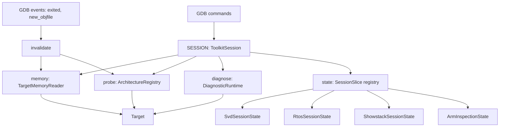

<!--
SPDX-FileType: DOCUMENTATION
SPDX-FileCopyrightText: 2026 H2Lab Development Team
SPDX-License-Identifier: Apache-2.0
-->
# Unified Session Technical Documentation

The session module ([implementation](https://github.com/h2lab/pyGdbToolkit/blob/main/src/pyGdbToolkit/session.py)) owns the whole
runtime context of a GDB debugging session: target-memory access, architecture identity,
diagnostic dispatch, and the per-command state previously scattered across the command modules.

Commands no longer create nor own their context. They request it from the process-wide `SESSION`
object, which handles its storage, its maintenance, and its invalidation.

---

## Technical Overview

The module provides:
1. **A single target-memory accessor**: one `TargetMemoryReader` is built per session and reused by
   every command instead of one reader per command invocation.
2. **A cached, architecture-neutral target identity**: the `ArchitectureRegistry` probes the target
   once, and the result is shared by all consumers.
3. **A diagnostic entry point**: `SESSION.diagnose()` dispatches a service through the
   `DiagnosticRuntime` without the caller handling the reader plumbing.
4. **A typed state registry**: each command declares a `SessionSlice` subclass and retrieves its
   unique instance through `SESSION.state()`.
5. **Coherence maintenance**: GDB events that change the target invalidate the volatile caches
   without destroying user-visible command state.

---

## Architecture and Workflow



---

## Data Models

### `SessionSlice`

Abstract base class of every command-owned state fragment.

- **`reset()`**: Abstract. Clears the slice **in place** and releases its target-dependent
  resources (breakpoints, watchpoints, decoded models).

A slice is created once per session and is never replaced, so a command module may bind it at
import time and keep a direct reference to it for the whole session. This is why clearing a slice
always happens in place rather than by rebinding a new instance.

### `ToolkitSession`

Owner of the session context.

- **`memory`**: Property returning the shared `WritableTargetMemory` accessor, built on first use
  from GDB's selected inferior. Raises `TargetReadError` when no inferior can be selected, which
  preserves the historical per-command error messages.
- **`probe()`**: Returns the cached `ProbeResult` produced by the architecture registry.
- **`architecture`**: Property returning the detected `Architecture`, or `None` when no registered
  probe recognized the target.
- **`require_target()`**: Returns the detected `TargetDescription` or raises `gdb.GdbError` with
  the probe's unavailability reason.
- **`require_target_of(description_type)`**: Same contract, narrowed to an architecture-specific
  description class (for example `CortexMTargetDescription`). Raises `gdb.GdbError` when the
  connected target is not described by that class.
- **`diagnose(service, access)`**: Runs one `DiagnosticServiceName` through the diagnostic runtime
  using the shared memory accessor, and returns the resulting `DiagnosticResult`.
- **`state(slice_type)`**: Returns the unique instance of a `SessionSlice` subclass, creating and
  registering it on first request.
- **`invalidate()`**: Drops the cached memory accessor and probe result, leaving command state
  untouched.
- **`reset()`**: Invalidates the caches, then calls `reset()` on every registered slice.

### `SESSION`

The process-wide `ToolkitSession` instance used by all commands.

### `install_event_hooks(session)`

Connects `gdb.events.exited`, `gdb.events.new_objfile`, and `gdb.events.clear_objfiles` to
`session.invalidate()`. The hooks are installed defensively: an embedded interpreter that does not
expose these event registries is silently supported.

---

## Multi-Architecture Support

The session core stays architecture-neutral: it only manipulates `Architecture`,
`TargetDescription`, `ProbeResult`, and `DiagnosticResult`, which are the portable contracts of
the [`arch`](https://github.com/h2lab/pyGdbToolkit/tree/main/src/pyGdbToolkit/arch) package. Adding a new architecture therefore requires no
change in the session module: registering an `ArchitectureProbe` in `DEFAULT_ARCHITECTURE_REGISTRY`
is enough for `SESSION.probe()` to recognize its targets.

Architecture-specific caching lives in the architecture package itself. For Arm, the
[Arm session state](https://github.com/h2lab/pyGdbToolkit/blob/main/src/pyGdbToolkit/arch/arm/session_state.py) module
defines `ArmInspectionState` and mutualizes:

- **`cortex_m_target(session)`**: Decoded CPUID identity (`CortexMTargetDescription`).
- **`rom_table_discovery(session)`**: CoreSight ROM-table discovery (`CoreSightDiscovery`).
- **`device_report(session)`**: Manufacturer `DeviceReport` produced by the provider registry.

This module is deliberately **not** re-exported by `arch.arm.__init__`: it is the only place where
the `arch` package depends on the session, and keeping it out of the package surface guarantees
that `arch` stays usable, and testable, without any session or GDB concern.

---

## Session State Slices

| Slice | Module | Contents | Reset behavior |
|---|---|---|---|
| `SvdSessionState` | `cmd_svd` | Parsed `SvdDevice`, dictionary export, SVD file path, register watchpoints | Deletes the watchpoints, drops the device model |
| `RtosSessionState` | `cmd_rtos` | Selected RTOS module, project path, decoded task list, scheduler trace | Deletes the scheduler trace, drops the project and the selection |
| `ShowstackSessionState` | `cmd_showstack` | Stack selected by the user (`msp` / `psp` / auto) | Restores automatic stack selection |
| `ArmInspectionState` | `arch.arm.session_state` | CPUID identity, ROM-table discovery, device report | Drops every cached inspection result |

---

## Cache Invalidation Policy

Two levels of clearing are distinguished, because target-derived data and user-supplied data do not
have the same lifetime:

- **`invalidate()`** drops only what is re-derivable from the target: the memory accessor and the
  probe result. It is what GDB event hooks call, so reconnecting a probe or loading new symbols
  never discards user work such as a loaded SVD file or an RTOS project.
- **`reset()`** additionally clears every registered slice. It is the full session teardown, used
  when the whole context must return to its initial state.

Note that `ArmInspectionState` holds target-derived data but lives in a slice, so it survives
`invalidate()` and is cleared by `reset()`.

---

## Usage

### Reading target memory from a command

```python
from .session import SESSION as TOOLKIT_SESSION
from .target_memory import TargetReadError

try:
    reader = TOOLKIT_SESSION.memory
except TargetReadError as error:
    raise gdb.GdbError(f"Cannot access target memory: {error}") from error
value = reader.read_uint32(0xE000ED00)
```

### Running a diagnostic service

```python
from .arch import DiagnosticServiceName
from .diagnostic_runtime import gdb_diagnostic_access
from .session import SESSION

result = SESSION.diagnose(DiagnosticServiceName.SECURITY_AUDIT, gdb_diagnostic_access())
```

### Requesting an architecture-specific target

```python
from .arch.arm.cortex_m import CortexMTargetDescription
from .session import SESSION

target = SESSION.require_target_of(CortexMTargetDescription)
```

### Enriching the session with a new command state

```python
from dataclasses import dataclass, field

from .session import SESSION as TOOLKIT_SESSION
from .session import SessionSlice


@dataclass
class TraceSessionState(SessionSlice):
    """Encapsulate the active trace configuration in the GDB session."""

    buffer_address: int | None = None
    captures: list[int] = field(default_factory=list)

    def reset(self) -> None:
        """Drop the configured buffer and the captured samples."""
        self.buffer_address = None
        self.captures.clear()


SESSION = TOOLKIT_SESSION.state(TraceSessionState)
```

No registration call, no import in the session module, and no change to `ToolkitSession` are
required: the slice is created and owned by the session on first request.

---

## Dependency Injection and Testing

`ToolkitSession` accepts its architecture registry and its diagnostic runtime as constructor
arguments, both defaulting to the package registries:

```python
session = ToolkitSession(architecture_registry=registry, diagnostic_runtime=runtime)
```

Command entry points that perform a diagnostic, `run_fault_analysis()` and `run_audit()`, accept a
session argument defaulting to `SESSION`, which keeps them testable against a substituted runtime
without a live target.

A test harness that exercises several targets in sequence should call `SESSION.reset()` between
scenarios, so that the cached accessor, the cached probe result, and the command slices do not leak
from one scenario to the next.
