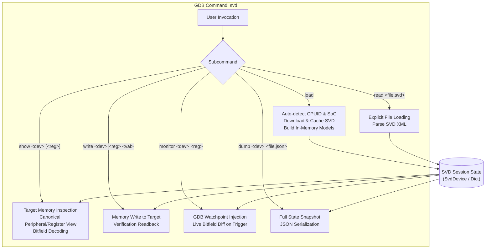

# `svd` Command Technical Documentation

The `svd` command provides full CMSIS-SVD hardware peripheral inspection, register manipulation, interactive monitoring, and JSON state dumping for ARM Cortex-M targets within GDB.

---

## Technical Overview

The `svd` command integrates with [src/pyGdbToolkit/svd.py](src/pyGdbToolkit/svd.py) to manage the lifecycle of hardware register descriptions:
1. **Auto-Detection**: Automatically identifies the connected MCU via CPUID and vendor electronic signatures, downloads the matching SVD file from [cmsis-svd/cmsis-svd-data](https://github.com/cmsis-svd/cmsis-svd-data), and loads the peripheral model and dictionary hierarchy into memory.
2. **Explicit Loading**: Accepts arbitrary user-supplied SVD XML files.
3. **Canonical Inspection**: Reads target peripheral registers over GDB memory access, displaying formatted tabular views and bitfield breakdowns.
4. **Register Manipulation**: Writes raw hex, binary, or decimal values into peripheral registers with automatic validation and readback verification.
5. **Interactive Monitoring**: Installs hardware/software watchpoints directly onto memory-mapped register addresses and reports live bitfield diffs whenever the target modifies them.
6. **Snapshot Dumping**: Serializes peripheral and register states into standardized JSON files for offline analysis or debugging diffs.

---

## Architecture and Command Workflow



---

## Command Reference

### 1. `svd load`

Automatically inspects the active target CPUID register (`0xE000ED00`) and vendor electronic signatures to locate, download, cache, and parse the appropriate SVD definition.

```text
(gdb) svd load
```

#### Output
- **On Success**: Displays a `Rich` table with detected vendor, product line, resolved SVD filename, device name, number of loaded peripherals, and local cache path.
- **On Failure**: Explicitly notifies the user with diagnostic details and advises using `svd read <file.svd>` for manual specification.

---

### 2. `svd read <file.svd>`

Loads an explicit SVD file from the local filesystem and initializes the session dictionary.

```text
(gdb) svd read /path/to/STM32F401.svd
(gdb) svd read ~/svd/nrf52840.svd
```

#### Output
Renders a `Rich` confirmation table summarizing device name, vendor, version, and loaded peripheral count.

---

### 3. `svd show <device_name> [<register_name>]`

Inspects the target memory and renders the live state of a peripheral or a specific register.

#### A. Reading a Peripheral
```text
(gdb) svd show GPIOA
```
Displays a canonical `Rich` table listing all registers in the peripheral:
- **Offset**: Address offset from peripheral base (e.g. `+0x0000`).
- **Register**: Register mnemonic (e.g. `MODER`, `ODR`, `IDR`).
- **Address**: Absolute physical memory address (e.g. `0x40020000`).
- **Size / Access**: Register bit width and access rights (e.g. `32-bit`, `read-write`).
- **Reset Value**: Default hardware reset value.
- **Current Value**: Live hexadecimal value read from target memory.
- **Description**: Functional documentation extracted from SVD.

#### B. Reading a Specific Register
```text
(gdb) svd show GPIOA MODER
```
Displays the register summary header and a decoded bitfield table:
- **Bits**: Bit range (e.g. `[1:0]`, `[5]`).
- **Field**: Bitfield identifier (e.g. `MODER0`, `MODER1`).
- **Access**: Access permissions (`read-write`, `read-only`, etc.).
- **Value (Hex / Dec / Bin)**: Live extracted value with binary representation.
- **Reset**: Field reset value.
- **Description**: Documentation for the bitfield.

---

### 4. `svd write <device_name> <register_name> <value_hex>`

Writes an integer or hexadecimal value into the specified target register and reads it back to confirm the write operation.

```text
(gdb) svd write GPIOA MODER 0xA8000000
(gdb) svd write USART1 CR1 0x200C
(gdb) svd write GPIOB BSRR 0b10000
```

#### Parameters
- `<device_name>`: Case-insensitive peripheral name.
- `<register_name>`: Case-insensitive register name.
- `<value_hex>`: Value in hexadecimal (`0x...`), binary (`0b...`), or decimal.

#### Output
Displays a table with target address, previous value, written value, and readback value.

---

### 5. `svd monitor <device_name> <regname>`

Installs a hardware or software write watchpoint on the register's target address. Whenever the firmware writes to or modifies this register, GDB halts execution and prints a live bitfield diff.

```text
(gdb) svd monitor GPIOA MODER
(gdb) svd monitor USART1 SR
```

#### Trigger Notification
When the watchpoint hits, `svd` prints:
- Register identifier and target address.
- Previous value vs. new value.
- Table of changed bitfields highlighting old and new values.

---

### 6. `svd dump <device_name> file.json`

Captures an instantaneous snapshot of the target state and exports it as a JSON file.

```text
(gdb) svd dump GPIOA gpioa_snapshot.json
(gdb) svd dump all complete_mcu_state.json
```

#### Parameters
- `<device_name>`: Peripheral name (e.g. `GPIOA`) or `all` / device name to dump all peripherals.
- `file.json`: Destination file path.

#### JSON Structure
```json
{
  "device": "STM32F401",
  "vendor": "STMicroelectronics",
  "version": "1.2",
  "timestamp_gdb": true,
  "peripherals": {
    "GPIOA": {
      "name": "GPIOA",
      "description": "General-purpose I/Os",
      "base_address": "0x40020000",
      "base_address_int": 1073872896,
      "registers": {
        "MODER": {
          "name": "MODER",
          "address": "0x40020000",
          "size": 32,
          "access": "read-write",
          "reset_value": "0x00000000",
          "value_raw": 2818572288,
          "value_hex": "0xA8000000",
          "fields": [
            {
              "name": "MODER0",
              "bit_offset": 0,
              "bit_width": 2,
              "value": 0,
              "hex_value": "0x0"
            }
          ]
        }
      }
    }
  }
}
```

---

## Intelligent Auto-Completion

The `svd` command implements intelligent GDB tab-completion:
- **Subcommands**: Completes `load`, `read`, `show`, `write`, `monitor`, `dump`, `help`.
- **Files**: Completes file paths and directories for `svd read <file.svd>`.
- **Peripherals / Devices**: Completes peripheral names dynamically from the loaded SVD device.
- **Registers**: Completes register names based on the selected peripheral for `show`, `write`, and `monitor`.
